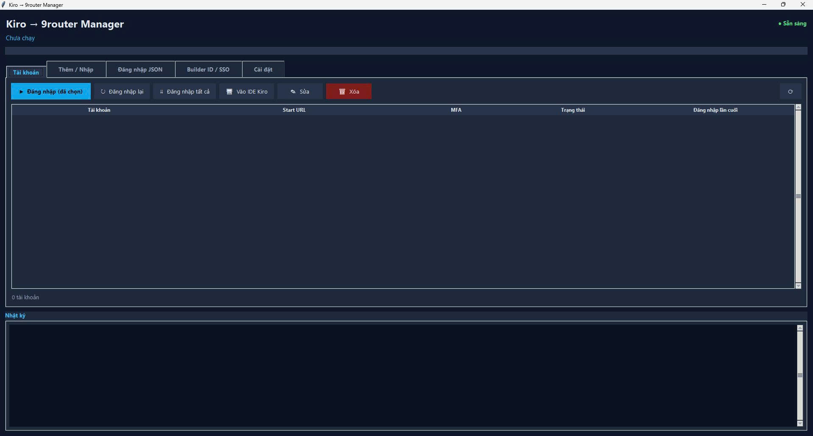
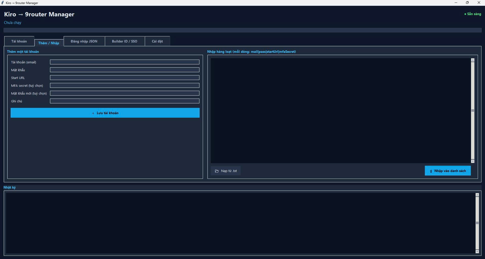
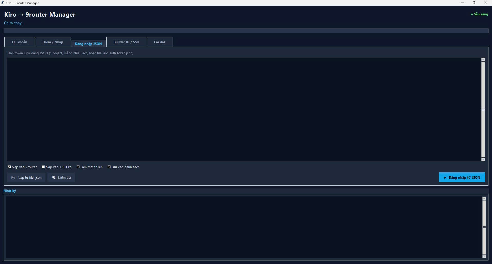
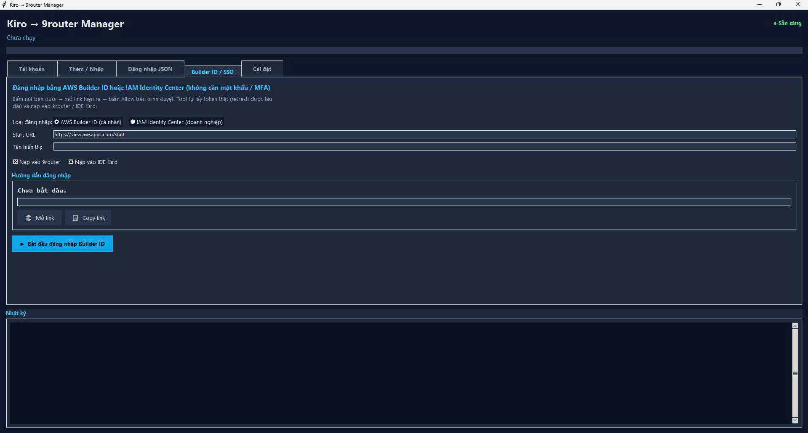
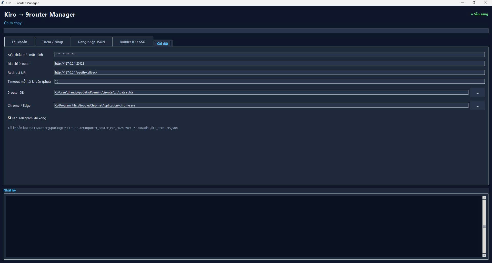

# 🚀 Kiro 9router Manager

**🌐 Language / Ngôn ngữ:** **English** · [Tiếng Việt](./README.vi.md)

> **A desktop GUI tool that helps you manage, log in, and load Kiro accounts (AWS CodeWhisperer / Kiro IDE) into 9router automatically — fast, clean, and in bulk.**


---

## 📖 Introduction

**Kiro 9router Manager** is a desktop application built with **Python + Tkinter** (with an easy-on-the-eyes *dark theme*) that helps you **manage multiple Kiro accounts** and automate logging them into **9router** (a *local AI model router/proxy*) as well as into the **Kiro IDE**.

Instead of logging in to each account manually, the tool lets you:

- Store and track the status of many accounts in a clear, visual table.
- Log in / re-login in **bulk** with just a few clicks.
- Load tokens into **both 9router and the Kiro IDE** at the same time.
- Sign in securely via **device-flow OIDC** (AWS Builder ID / IAM Identity Center) with **no password, no MFA, and no browser automation**.

Everything is packed into a tidy 5-tab GUI, or you can use it as a **CLI** if you prefer automation.

---

## ✨ Key Features

- 🗂️ **Multi-account management** — a `Treeview` table shows all your accounts with their status: `OK` / `Error` / `Never logged in`.
- ⚡ **Bulk login** — select multiple rows, log in / re-login them all at once, and open the Kiro IDE directly.
- 🔐 **Device-flow OIDC (the most powerful feature)** — sign in via **AWS Builder ID** or **IAM Identity Center** with no password/MFA/browser automation. The tool shows a code + link → you click *Allow* → the tool automatically obtains a **real** `accessToken` + `refreshToken` (long-lived, refreshable).
- 📥 **Flexible import** — add accounts one by one, or paste them in bulk using the `mail|pass|startUrl|mfaSecret` format.
- 🧩 **Multi-format JSON token parsing** — accepts a `kiro-auth-token.json` file, an array of multiple accounts, or an export from 9router → auto-detects and loads them.
- 🔄 **Automatic token refresh** — supports both OIDC (`oidc.{region}.amazonaws.com/token`) and social auth (`prod.us-east-1.auth.desktop.kiro.dev/refreshToken`).
- 💾 **Thread-safe account store** — saves to JSON with *atomic writes*, keeping both `mfaSecret` and `password` for automatic re-login.
- 🪪 **Supports both Social Auth and IAM Identity Center (IDC)**.
- 🧠 **AWS SSO cache integration** — writes tokens into `~/.aws/sso/cache` so opening the Kiro IDE means you're already logged in.
- 📦 **`.exe` packaging** — pre-built with **PyInstaller** using the `Kiro9RouterImporter.spec` file.

---

## 🖼️ Screenshots / Demo

A **dark theme** interface with 5 tidy tabs:

### 1️⃣ Accounts tab — multi-account management table


### 2️⃣ Add / Import tab — add manually or paste in bulk


### 3️⃣ JSON Login tab — load tokens in multiple JSON formats


### 4️⃣ Builder ID / SSO tab — device-flow OIDC (no password/MFA)


### 5️⃣ Settings tab — configure 9router, DB, Chrome


---

## 🧰 System Requirements

- **Python** — 3.10 or higher
- **Node.js** — required for the `.mjs` engine (uses `playwright-core`)
- **9router** — running locally (default `http://127.0.0.1:20128`)
- **Google Chrome** — used for the browser automation flow
- **Operating system** — Windows (recommended)

---

## ⚙️ Installation & Usage

### 1. Clone the repo

```bash
git clone https://github.com/Thangterter-Pipo/kiro-9router-manager.git
cd kiro-9router-manager
```

### 2. Install dependencies

```bash
# The GUI core uses the Python standard library — no extra pip install needed.
npm install playwright-core   # for the .mjs engine (browser automation)
```

### 3. Start 9router

Make sure 9router is running on its local address (default `http://127.0.0.1:20128`).

### 4. Run the GUI

```bash
python scripts/kiro_9router_gui.py
```

### 🔧 Using the CLI

```bash
# Run the core / import from a file
python scripts/kiro_9router_app.py --input <file> --timeout-minutes N

# Device-flow OIDC login (Builder ID / IdC)
python scripts/kiro_device_login.py \
    --start-url https://view.awsapps.com/start \
    --targets 9router,ide

# Login from a JSON token
python scripts/kiro_json_login.py --file token.json --targets 9router,ide
```

---

## 🧭 Tab-by-Tab Guide

### 1️⃣ **Accounts** tab
Your management hub. The `Treeview` table lists all accounts with their status. Here you can:
- Select **multiple rows** to **log in / re-login in bulk**.
- Click **Open Kiro IDE** to launch the IDE with the selected account.
- **Edit** / **Delete** accounts.
- Track the `OK` / `Error` / `Never logged in` status.

### 2️⃣ **Add / Import** tab
Add accounts to the store:
- Add **a single** account via the form.
- Or **paste in bulk** using the format:
  ```
  mail|pass|startUrl|mfaSecret
  ```

### 3️⃣ **JSON Login** tab
Paste a Kiro token in **JSON** form — multiple formats supported:
- A `kiro-auth-token.json` file
- An array of multiple accounts
- An export from 9router

The tool automatically **parses** it and loads it into 9router / the IDE. A **refresh token option** is available.

### 4️⃣ **Builder ID / SSO** tab 🏆 *(most powerful)*
Sign in via **device-flow OIDC** — no password, MFA, or browser automation:
1. Click the login button.
2. The tool shows a **code** + **link**.
3. You open the link and click **Allow**.
4. The tool automatically obtains a **real** `accessToken` + `refreshToken` (long-lived).

Supports both **AWS Builder ID** and **IAM Identity Center**.

### 5️⃣ **Settings** tab
Configure:
- The **9router** address.
- The **DB path**.

---

## 📦 Build the `.exe`

Package the application into a standalone executable with PyInstaller:

```bash
pip install pyinstaller
python -m PyInstaller --noconfirm Kiro9RouterImporter.spec
```

The `Kiro9RouterImporter.spec` file is already included in the repo and configures everything needed.

---

## 🌱 Environment Variables (optional)

- `NINEROUTER_DB` — path to the 9router database
- `NINEROUTER_BASE_URL` — base URL of 9router
- `CHROME_PATH` — path to Google Chrome

---

## 🗂️ Project Structure

```
scripts/
├── kiro_9router_gui.py                        # Main GUI (5 tabs, dark theme)
├── kiro_9router_app.py                        # Core entry point / CLI
├── kiro_account_store.py                      # Account storage manager (JSON, thread-safe)
├── kiro_device_login.py                       # Device-flow OIDC login (Builder ID / IdC)
├── kiro_json_login.py                         # Login from a JSON token
├── kiro_ide_login.py                          # Write tokens into AWS SSO cache for the Kiro IDE
├── ninerouter_kiro_login.py                   # Backend login + write 9router DB
├── ninerouter_kiro_bulk_import.py             # Bulk import
├── ninerouter_kiro_idc_auto_import.mjs        # Browser automation engine (Node + playwright-core)
└── ninerouter_kiro_idc_interactive_import.py  # Interactive import

Kiro9RouterImporter.spec                       # PyInstaller build configuration
```

---

## ⚠️ Disclaimer & License

> **Important:** This tool is **ONLY** for **valid Kiro accounts that you own**. We **do not encourage** any behavior that violates or abuses the AWS / Kiro Terms of Service. Users are solely responsible for how they use it.

This project is released under the **MIT** license — free to use, modify, and distribute.

---

## 👤 Author

**Thangterter-Pipo**
🔗 [github.com/Thangterter-Pipo](https://github.com/Thangterter-Pipo)

---

<p align="center">⭐ If you find this useful, please leave a star on the repo! ⭐</p>
